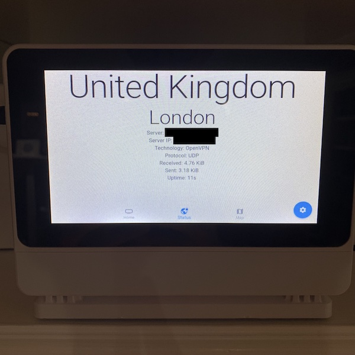

# VPN Control for Raspberry Pi


|                       |                       |                       |
| --------------------- | --------------------- | --------------------- |
||||
||||

# Hardware used in photos

* [Raspberry Pi 4 Model B](https://www.raspberrypi.org/products/raspberry-pi-4-model-b/)
* Raspberry Pi Power Supply
* microSD card
* Touch display (e.g., [Raspberry Pi Touch Display](https://www.raspberrypi.org/products/raspberry-pi-touch-display/))
* Case for Raspberry Pi Touch Display (e.g., [SmartiPi Touch Pro](https://smarticase.com/products/smartipi-touch-pro?variant=39297984790591))

# Raspbian Lite Install

Begin with a clean install of the latest release of a supported Linux distribution. In the example below, Raspberry Pi OS (32-bit) Lite is used. Download and install Raspbian Lite. In contrast to Raspian Desktop, [Raspian Lite](https://www.raspberrypi.org/software/operating-systems/) has no desktop environment preinstalled and is generally much lighter and smaller in size.

This guide is based on the May 7th 2021 version of Raspberry Pi OS (32-bit) Lite Buster (Kernel version: 5.10), but it should work for other versions, too.

Boot up the Raspberry Pi, login as user `pi` with password `raspberry`, then start `sudo raspi-config` to apply some initial customizations:

* Localisation Options: Select your preferred locale (we change the default to `en_US.UTF-8`), timezone, and keyboard layout.
* Change User Password: This is **important** – keeping the default password means your Pi will get owned faster than you can say "botnet" as soon as you connect it to the internet. (Make sure to have selected the correct keyboard layout before typing in the new password, though.)
* Boot Options: Select "Desktop / CLI" and then "Console Autologin". We'll come back to this later.
* Interfacing Options: Enable SSH access if needed.

Now reboot the Pi. If everything was done correctly you should end up in a terminal session without having to enter your password.

To conclude the initial setup, update all preinstalled packages:

```
sudo apt-get update
sudo apt-get full-upgrade
sudo reboot
```

# Setup Browser with Kiosk Mode

## Minimum Environment for GUI Applications

Usually the graphical environment for GNU/Linux consists of four parts:

* X server (usually X.Org)
* Window manager (Openbox, XFWM, …)
* Desktop environment (PIXEL, LXDE, MATE, …)
* Login manager (for example LightDM)

However, we only want to run a single application (the web browser) in full screen – so we don't need a desktop environment. And we already have autologin enabled (and no other users will ever use the Pi) – so we don't need a login manager either.

The bare minimum we need are X server and window manager. Let's install just that:

```
sudo apt-get install --no-install-recommends xserver-xorg x11-xserver-utils xinit openbox
```

## Web Browser

We'll use Chromium because it provides a nice kiosk mode:

```
sudo apt-get install --no-install-recommends chromium-browser
```

## Openbox Configuration

Now with everything in place, we can configure Openbox. Edit `/etc/xdg/openbox/autostart` and replace its content with the following:

```
# Disable any form of screen saver / screen blanking / power management
xset s off
xset s noblank
xset -dpms

# Allow quitting the X server with CTRL-ATL-Backspace
setxkbmap -option terminate:ctrl_alt_bksp

# Start Chromium in kiosk mode
sed -i 's/"exited_cleanly":false/"exited_cleanly":true/' ~/.config/chromium/'Local State'
sed -i 's/"exited_cleanly":false/"exited_cleanly":true/; s/"exit_type":"[^"]\+"/"exit_type":"Normal"/' ~/.config/chromium/Default/Preferences
chromium-browser --disable-infobars --kiosk 'http://your-url-here'
```

First we disable screen blanking and power management (we don't want our screen to go blank or even turn off completely after some time).

Then we allow to quit the X server by pressing `Ctrl-Alt-Backspace`. (Because we didn't install a desktop environment there won't be a "Log out" button or the like.)

Finally we tell Openbox to start Chromium in kiosk mode. This turns out to be a bit intricate because Chromium loves to show various tool bubbles for session restore etc. The simplest way to avoid all of these seems to be tricking Chromium into thinking it exited cleanly last time it was run (see this answer on Super User for details).

That's it! Time to give it a try:

```
startx -- -nocursor
```

After a few seconds Chromium should appear showing the URL you specified. We will change the URL later to point to the local webserver. Oh, and as you might have guessed: The `-nocursor` option tells X to not display any mouse cursor at all.

Press `Ctrl-Alt-Backspace` to quite the X server, bringing you back into the text console.

## Start X automatically on boot

Now there's only one thing left: The X server should start automatically on boot.

Because we already configured the Pi to autologin the `pi` user, we can use its `.bash_profile` for starting X. Simply append the following line:

```
[[ -z $DISPLAY && $XDG_VTNR -eq 1 ]] && startx -- -nocursor
```

The condition makes sure that X is only started on the first console (and if it isn't already running). Because autologin uses the first console, this has the desired effect of automatically starting the X server (and thus the window manager and thus Chromium) on boot. And you can still use any of the other consoles for logging in manually.

Reboot your pi to test if everything works as expected.

## Usage tips

* If Chromium (or the X server) crashes, press `Ctrl-Alt-Backspace` to kill the X server and restart it with `startx -- -nocursor`.
* If you need a terminal session, you can switch to one of the other consoles by pressing `Ctrl-Alt-F2` (or any other function key). Pressing `Ctrl-Alt-F1` brings you back to the first console where Chromium is running.

# Install Access Point

Set the WiFi country in raspi-config's Localisation Options:

```
sudo raspi-config
```

Invoke RaspAP's Quick Installer:

```
curl -sL https://install.raspap.com | bash
```

The Quick Installer will complete the steps in the manual installation for you.

Following a reboot, the wireless AP network will be configured as follows:

```
IP address: 10.3.141.1
Username: admin
Password: secret
DHCP range: 10.3.141.50 — 10.3.141.255
SSID: raspi-webgui
Password: ChangeMe
```

It is strongly recommended that you change these default credentials in RaspAP's Authentication and Hotspot > Security panels.

Your AP's basic settings and many advanced options may now be modified by RaspAP. More information can be found on the [RaspAP website](https://raspap.com/)

# Install & Configure NordVPN

This tutorial explains how to download and install the NordVPN app, log in, and connect to our servers.

## Downloading the app

Download the NordVPN Linux client by opening the terminal, writing the command below, and following any on-screen instructions:

```
sh <(curl -sSf https://downloads.nordcdn.com/apps/linux/install.sh)
```

**Note:** If you do not have a curl package, evidenced by the fact that the above does not work, you can alternatively use this command:

```
sh <(wget -qO - https://downloads.nordcdn.com/apps/linux/install.sh)
```

Additionally, if you receive the following issue: Whoops! Permission denied accessing `/run/nordvpn/nordvpnd.sock`, all you need to do is write the following command: `sudo usermod -aG nordvpn $USER` and then reboot your device.

Log in to your NordVPN account:

```
nordvpn login
```

Connect to a NordVPN server:

```
nordvpn connect
```

Disconnect from NordVPN server:

```
nordvpn disconnect
```

# Install nvm, node, and npm

Node Version Manager (NVM) is a tool that allows you to install versions for node.js. A number of our examples use node.js so you may need to install node before you can run our JavaScript examples. 

The full version of Raspberry Pi Raspbian comes with node.js pre-installed but if you chose to install the light version than you will need to follow these steps to install node.js.

To install or update nvm, use the install script using cURL:

```
curl -o- https://raw.githubusercontent.com/nvm-sh/nvm/v0.38.0/install.sh | bash
```

The script clones the nvm repository to `~/.nvm` and adds the source line to your profile (`~/.bash_profile`).

```
export NVM_DIR="$HOME/.nvm"
[ -s "$NVM_DIR/nvm.sh" ] && \. "$NVM_DIR/nvm.sh" # This loads nvm
```

Now check if the nvm is installed by typing:

```
command -v nvm
```

The above command should return `nvm`

Now install the latest stable version of node.js by typing:

```
nvm install stable
```

Now type the following to see the version you have just installed:

```
node -v
```

# Install PM2 Daemon process manager

PM2 is a daemon process manager that will help you manage and keep your application online 24/7. Install pm2 globally with the following `npm` command.

```
npm install pm2 -g
```

# Build API and Web services

Clone this repository to your Raspberry Pi.

```
git clone https://github.com/raedle/pipn.git
```

## Build API service

Build the API service, which is an Apollo GraphQL server with GraphQL queries and mutations to connect to NordVPN, disconnect from it, and check the status of a connection. It also provides mutations to reboot and shutdown the Raspberry Pi or turn on and off the Raspberry Pi Touch Display. 

```
cd api
yarn install
yarn build
```

Start the api service as daemon service:

```
pm2 start build/index.js
```

## Build Web service

Build the Web service, which is a React app providing a simple UI to call the API service queries and mutations.

```
cd web
yarn install
yarn build
```

Start the web service as daemon service:

```
pm2 serve build 3000 --spa  
```

## Setup startup script

Restarting PM2 with the processes you manage on server boot/reboot is critical. To solve this, just run this command to generate an active startup script:

```
pm2 startup
```

And to freeze a process list for automatic respawn:

```
pm2 save
```

Read more about startup script generator on the [PM2 website](https://pm2.keymetrics.io/).

## Change chromium-browser kiosk URL

Edit `/etc/xdg/openbox/autostart` and replace its content with the following:

```
# Disable any form of screen saver / screen blanking / power management
xset s off
xset s noblank
xset -dpms

# Allow quitting the X server with CTRL-ATL-Backspace
setxkbmap -option terminate:ctrl_alt_bksp

# Start Chromium in kiosk mode
sed -i 's/"exited_cleanly":false/"exited_cleanly":true/' ~/.config/chromium/'Local State'
sed -i 's/"exited_cleanly":false/"exited_cleanly":true/; s/"exit_type":"[^"]\+"/"exit_type":"Normal"/' ~/.config/chromium/Default/Preferences
chromium-browser --disable-infobars --kiosk 'http://localhost:3000'
```

# Acknowledgements

This walkthrough contains contents from the following sources:

* https://die-antwort.eu/techblog/2017-12-setup-raspberry-pi-for-kiosk-mode/
* https://raspap.com/
* https://support.nordvpn.com/Connectivity/Linux/1325531132/Installing-and-using-NordVPN-on-Debian-Ubuntu-Raspberry-Pi-Elementary-OS-and-Linux-Mint.htm
* https://pm2.keymetrics.io/
* https://www.jemrf.com/pages/how-to-install-nvm-and-node-js-on-raspberry-pi
* https://github.com/nvm-sh/nvm

# License
pipn is MIT licensed, as found in the [LICENSE][license] file.

[license]: LICENSE.md